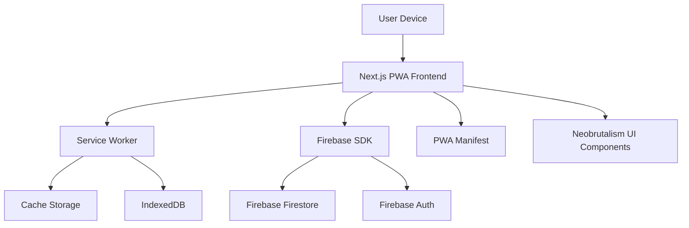

# Design Document

## Overview

This design outlines the architecture for a Progressive Web App built with Next.js 14, featuring app-like installation capabilities, Firebase backend integration, and neobrutalism design aesthetics. The application will provide a native-like experience across Android and iOS devices while maintaining web accessibility and performance standards.

## Architecture

### High-Level Architecture



### Technology Stack

- **Frontend Framework**: Next.js 14 with App Router
- **PWA Implementation**: next-pwa plugin with Workbox
- **Backend Services**: Firebase (Firestore, Authentication)
- **Styling**: Tailwind CSS with custom neobrutalism components
- **State Management**: React Context + useReducer for complex state
- **Offline Storage**: IndexedDB via Dexie.js
- **Build Tool**: Next.js built-in bundler with PWA optimizations

## Components and Interfaces

### Core Components

#### 1. PWA Installation Manager
```typescript
interface InstallationManager {
  canInstall: boolean;
  isInstalled: boolean;
  showInstallPrompt(): Promise<void>;
  handleInstallEvent(): void;
  trackInstallationState(): void;
}
```

**Responsibilities:**
- Detect installation capability across different browsers
- Manage custom install prompts for Android
- Provide iOS-specific installation instructions
- Track installation state and prevent duplicate prompts

#### 2. Service Worker Controller
```typescript
interface ServiceWorkerController {
  register(): Promise<void>;
  updateAvailable: boolean;
  skipWaiting(): void;
  handleOfflineRequests(): void;
  manageCacheStrategy(): void;
}
```

**Responsibilities:**
- Register and manage service worker lifecycle
- Implement caching strategies (Cache First, Network First, Stale While Revalidate)
- Handle offline functionality and background sync
- Manage app updates and cache invalidation

#### 3. Firebase Integration Layer
```typescript
interface FirebaseService {
  auth: AuthService;
  firestore: FirestoreService;
  initializeApp(): Promise<void>;
  handleOfflineSync(): void;
}

interface AuthService {
  // Email/Password Authentication
  signIn(email: string, password: string): Promise<User>;
  signUp(email: string, password: string): Promise<User>;
  signOut(): Promise<void>;
  getCurrentUser(): User | null;
  
  // Password Management
  sendPasswordResetEmail(email: string): Promise<void>;
  updatePassword(newPassword: string): Promise<void>;
  
  // Profile Management
  updateProfile(displayName?: string, photoURL?: string): Promise<void>;
  deleteAccount(): Promise<void>;
  
  // Authentication State
  onAuthStateChanged(callback: (user: User | null) => void): () => void;
  isAuthenticated(): boolean;
  
  // Email Verification
  sendEmailVerification(): Promise<void>;
  verifyEmail(code: string): Promise<void>;
}

interface FirestoreService {
  create<T>(collection: string, data: T): Promise<string>;
  read<T>(collection: string, id: string): Promise<T>;
  update<T>(collection: string, id: string, data: Partial<T>): Promise<void>;
  delete(collection: string, id: string): Promise<void>;
  enableOfflinePersistence(): Promise<void>;
}
```

#### 4. Neobrutalism UI System
```typescript
interface NeobrutalistComponent {
  variant: 'primary' | 'secondary' | 'accent';
  size: 'sm' | 'md' | 'lg' | 'xl';
  shadow: 'none' | 'sm' | 'md' | 'lg' | 'brutal';
  border: boolean;
  rounded: boolean;
}

interface NeobrutalistTheme {
  colors: {
    primary: string;
    secondary: string;
    accent: string;
    background: string;
    surface: string;
  };
  typography: {
    heading: string;
    body: string;
    mono: string;
  };
  shadows: {
    brutal: string;
    offset: string;
  };
}
```

### Page Components

#### 1. App Shell
- Persistent navigation with neobrutalist styling
- Installation prompt integration
- Offline status indicator
- Loading states with brutal design elements

#### 2. Home/Dashboard
- Hero section with bold typography
- Feature cards with chunky shadows
- Installation CTA with prominent styling
- Data visualization with geometric shapes

#### 3. Authentication Pages
- Sign In form with email/password fields
- Sign Up form with email verification flow
- Password reset functionality
- Email verification confirmation page

#### 4. Settings/Profile
- User profile management (display name, photo)
- Password change functionality
- Account deletion option
- App preferences with toggle switches
- Installation status and management
- Data sync status indicators

## Data Models

### User Data Model
```typescript
interface User {
  id: string;
  email: string;
  displayName?: string;
  profileImage?: string;
  emailVerified: boolean;
  preferences: UserPreferences;
  createdAt: Timestamp;
  lastLoginAt: Timestamp;
  authProvider: 'email' | 'google' | 'anonymous';
}

interface AuthState {
  user: User | null;
  loading: boolean;
  error: string | null;
  isAuthenticated: boolean;
}

interface UserPreferences {
  theme: 'light' | 'dark' | 'auto';
  notifications: boolean;
  offlineMode: boolean;
  dataSync: boolean;
}
```

### App Data Model
```typescript
interface AppData {
  id: string;
  userId: string;
  content: any; // Flexible content structure
  createdAt: Timestamp;
  updatedAt: Timestamp;
  syncStatus: 'synced' | 'pending' | 'conflict';
}
```

### Installation State Model
```typescript
interface InstallationState {
  canInstall: boolean;
  isInstalled: boolean;
  platform: 'android' | 'ios' | 'desktop' | 'unknown';
  promptShown: boolean;
  installationDate?: Date;
}
```

## Error Handling

### Error Categories

1. **Network Errors**
   - Offline detection and graceful degradation
   - Retry mechanisms with exponential backoff
   - User-friendly offline indicators

2. **Firebase Errors**
   - Authentication failures (invalid credentials, weak password, email already in use)
   - Email verification errors and resend functionality
   - Password reset failures with user guidance
   - Firestore permission errors with authentication prompts
   - Quota exceeded handling with upgrade suggestions

3. **PWA Installation Errors**
   - Unsupported browser fallbacks
   - Installation failure recovery
   - Manifest validation errors

4. **Service Worker Errors**
   - Registration failures
   - Cache corruption recovery
   - Update conflicts resolution

### Error Handling Strategy

```typescript
interface ErrorHandler {
  handleNetworkError(error: NetworkError): void;
  handleFirebaseError(error: FirebaseError): void;
  handlePWAError(error: PWAError): void;
  showUserFriendlyMessage(error: AppError): void;
  logError(error: Error, context: string): void;
}
```

## Testing Strategy

### Unit Testing
- Component testing with React Testing Library
- Service worker testing with Workbox testing utilities
- Firebase rules testing with Firebase emulator
- Utility function testing with Jest

### Integration Testing
- PWA installation flow testing
- Offline/online state transitions
- Firebase data synchronization
- Cross-browser compatibility testing

### End-to-End Testing
- Installation process on real devices
- Offline functionality validation
- Performance testing with Lighthouse CI
- Accessibility testing with axe-core

### Performance Testing
- Core Web Vitals monitoring
- Bundle size analysis
- Cache effectiveness measurement
- Network request optimization validation

## PWA Manifest Configuration

```json
{
  "name": "PWA App",
  "short_name": "PWAApp",
  "description": "A neobrutalist PWA with native-like installation",
  "start_url": "/",
  "display": "standalone",
  "background_color": "#000000",
  "theme_color": "#ff6b35",
  "orientation": "portrait-primary",
  "icons": [
    {
      "src": "/icons/icon-192x192.png",
      "sizes": "192x192",
      "type": "image/png",
      "purpose": "maskable any"
    },
    {
      "src": "/icons/icon-512x512.png",
      "sizes": "512x512",
      "type": "image/png",
      "purpose": "maskable any"
    }
  ],
  "categories": ["productivity", "utilities"],
  "screenshots": [
    {
      "src": "/screenshots/desktop.png",
      "sizes": "1280x720",
      "type": "image/png",
      "form_factor": "wide"
    },
    {
      "src": "/screenshots/mobile.png",
      "sizes": "750x1334",
      "type": "image/png",
      "form_factor": "narrow"
    }
  ]
}
```

## Service Worker Strategy

### Caching Strategy
- **App Shell**: Cache First with fallback
- **API Responses**: Network First with cache fallback
- **Static Assets**: Stale While Revalidate
- **User Data**: Network Only with offline queue

### Background Sync
- Queue failed requests for retry when online
- Sync user data changes in background
- Handle conflict resolution for concurrent edits

## Neobrutalism Design System

### Color Palette
- **Primary**: Bold, high-contrast colors (#000000, #FFFFFF)
- **Accent**: Vibrant highlights (#FF6B35, #00D4AA, #FFE66D)
- **Shadows**: Deep, offset shadows for depth
- **Borders**: Thick, black borders for definition

### Typography
- **Headings**: Bold, chunky fonts (Inter Black, Archivo Black)
- **Body**: High contrast, readable fonts (Inter, System UI)
- **Monospace**: Code and technical content (JetBrains Mono)

### Component Styling
- **Buttons**: Thick borders, offset shadows, bold colors
- **Cards**: Geometric shapes, strong shadows, high contrast
- **Forms**: Chunky inputs, bold labels, clear validation states
- **Authentication Forms**: Prominent error messages, success states with brutal styling
- **Navigation**: Bold, geometric menu items with shadows
- **Loading States**: Chunky progress indicators and skeleton screens

### Responsive Design
- Mobile-first approach with brutal aesthetics
- Touch-friendly targets (minimum 44px)
- Consistent shadow and border scaling
- Adaptive typography for different screen sizes